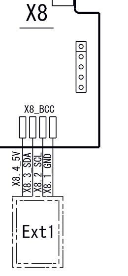

# DIY Daikin Boiler EEPROM Recovery Guide

_Or: How I Learned to Stop Worrying and Love the Hex Editor_

## ⚠️ The Legally Required Scary Part

**WARNING:** This guide involves poking around your boiler's brain with wires and software. If you brick it, set your house on fire, or accidentally teach it sentience, that's on you. Proceed at your own risk, and maybe keep a fire extinguisher handy.

---

## The Problem

Your Daikin Altherma boiler is stuck displaying an error code that refuses to die. You've tried:

- Mashing the reset button like it owes you money
- Unplugging it and plugging it back in (the universal fix)
- Pleading with it softly

Nothing works. The error persists like a bad song stuck in your head.

**Why?** Your boiler's motherboard has written a "latched error" into its EEPROM—essentially tattooing the error into permanent memory. It's the digital equivalent of holding a grudge.

## The Traditional Solution

Call a licensed technician who arrives with a magical "BCC key"—a small device containing a factory-fresh EEPROM image. They plug it in, your boiler gets a memory wipe, and boom—€€€ lighter, you're back in business.

**The catch:** These keys are rare, expensive, and slow to obtain. Perfect if you enjoy cold showers in winter.

## The Fun Solution

Why wait when you can reverse-engineer your way out of this mess?

Armed with an Arduino, some wires, and an unhealthy amount of stubbornness, you can read the EEPROM, identify the problematic bytes, fix them, and restore your boiler to working order. It's like open-heart surgery, but for heating systems.

**Fair warning:** This guide represents countless hours of trial and error, binary analysis, and conversations with AI to figure out the exact bytes responsible for the lockout. You're getting the condensed, battle-tested version. What took me days of head-scratching should take you under an hour. You're welcome.

---

## What You'll Need

### Hardware

- An Arduino (or Arduino-compatible board)
- 4 jumper wires
- Your boiler's motherboard (already installed, presumably)

### Software

- Arduino IDE
- Python 3 with `pyserial` (`pip3 install pyserial`)
- A hex editor ([010 Editor](https://www.sweetscape.com/010editor/) recommended)

### Intangibles

- Basic understanding of electronics (knowing which end of a wire is which)
- Common sense (don't lick the circuits)
- Patience (lots of it)

---

## The Technical Details

### EEPROM Info

- **Chip:** NV24C64 (8KB capacity)
- **I²C Address:** `0x57` (use Arduino SCAN if yours differs)
- **The Culprit Bytes:**
  - `0x0058` = fatal_fault_active
  - `0x0059` = fatal_fault_qualifier

**Faulted state:** `01 01`  
**Fixed state:** `00 00`

Yep. Two bytes. That's all standing between you and warmth.

---

## Step-by-Step Instructions

### 1. Connect Your Arduino to the EEPROM

Locate your boiler's BCC key connector (check your manual—mine was labeled X8).
You'll need to connect four pins:

| EEPROM Pin | Arduino Pin (NodeMCU V3 example) |
| ---------- | -------------------------------- |
| GND        | G                                |
| VCC (3.3V) | 3V3 (max 5V)                     |
| SCL        | D1                               |
| SDA        | D2                               |

My boiler's motherboard exposes this pin set:


Yours might differ. But will be 4 pins too.

**No soldering required.** Just carefully connect the wires to the correct pins. Getting this wrong would be... suboptimal.

### 2. Upload the Arduino Sketch

Open `eeprom.ino` in Arduino IDE, compile, and upload it to your board. This sketch handles:

- Scanning for the EEPROM address
- Reading the entire chip
- Writing data back

_Pro tip:_ If your Arduino stops responding, unplug it and plug it back in. Even electronics need a good reboot sometimes.

### 3. Read the EEPROM

Run this command to dump the EEPROM contents to a file:

```bash
./flash.py read -o eeprom.bin -p /dev/cu.usbserial-1130
```

Replace `/dev/cu.usbserial-1130` with your actual USB port.

### 4. Fix the Binary

Open `eeprom.bin` in your hex editor. Search for `01 01` near the beginning of the file (around addresses `0x0058` and `0x0059`). Change those bytes to `00 00`.

Save as `eeprom_fixed.bin` (keep the original—trust me on this).

### 5. Write It Back

Flash your fixed EEPROM back to the chip:

```bash
./flash.py write -i eeprom_fixed.bin -p /dev/cu.usbserial-1130
```

### 6. The Moment of Truth

1. Disconnect the four wires
2. Plug your boiler back into power
3. The error will appear _one last time_
4. Hold the reset button for a few seconds
5. Marvel as your boiler returns to normal operation

---

## Final Notes

**Before celebrating:** Actually fix whatever caused the original error. Your boiler didn't latch that error for fun—something was legitimately wrong. Resetting the error without addressing the root cause is like putting a band-aid on a broken leg.

**And remember:** You now possess forbidden knowledge. Use it wisely. Or at least responsibly.

_Voilà!_
